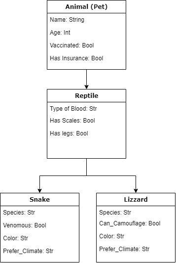

# Object Oriented Programming

## Contents

- [Introduction](#introduction)
- [4 Pillars of OOP](#4-pillars-of-oop)
- [Modules (Python)](#modules-python)
- [Method and Function](#method-and-function)
- [Class](#classes)


## Introduction

Object Oriented Programming (OOP) is a programming paradigm that uses objects and their interactions to design and program applications. OOP is a way of thinking about programming, based on real-world entities like objects, their attributes and methods.

### 4 Pillars of OOP

Look at oop_pillar.md

### Modules (Python)

Modules are simply python files with a .py extension. The name of the module will be the name of the file.
Built-in modules are modules that are pre-installed with python. You can use them by importing them into your project.
You can create your own modules by creating a python file with a .py extension.

Example of built-in module:

```python
import math, random, datetime, sys

print(math.pi)
print(random.randint(1, 10))
print(datetime.date.today())
print(sys.version)
```

### Method and Function

A method is a function that is associated with an object. A method is called using the dot notation.

A function is a block of code which only runs when it is called. You can pass data, known as parameters, into a function. A function can return data as a result.

```python
def my_function():
  print("Hello from a function")

my_function()
```

### Classes

A class is a blueprint for the object.

```python
class MyClass:
  x = 5

p1 = MyClass()
print(p1.x)
```

#### Inheritance



Inheritance allows us to define a class that inherits all the methods and properties from another class.

Parent class is the class being inherited from, also called base class.

Child class is the class that inherits from another class, also called derived class.

```python
class Person:
  def __init__(self, fname, lname): # Attributes of the class, also called fields
    self.firstname = fname
    self.lastname = lname

  def printname(self):
    print(self.firstname, self.lastname)

class Student(Person):
  pass

x = Student("Mike", "Olsen")
x.printname()
```

#### Constructor

`__init__()` is a reseved method in python classes (function). It is known as a constructor in object oriented concepts. This method called when an object is created from the class and it allow the class to initialize the attributes of a class.

```python
class Person:
  def __init__(self, fname, lname): #Constructor
    self.firstname = fname
    self.lastname = lname

  def printname(self):
    print(self.firstname, self.lastname)

```

#### Object

An object is an instance of a class. When the individual object is created, memory is allocated.
In this case `p1` is an object of the class Person.

```python
p1 = Person("John", "Doe")
p1.printname()
```
